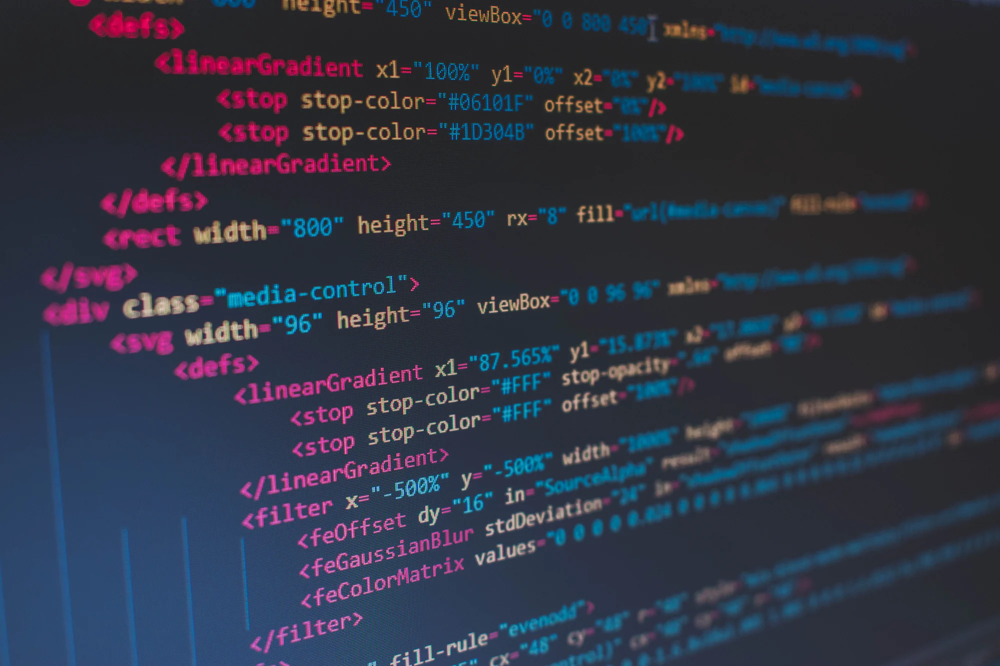

# Website
This is a sample website showcasing a simple layout and design using HTML, CSS and JavaScript.
 includes a navigation bar, a header image
 
  and a description section with some information about the website. The main content of the website includes a history section and a qualifications section, which showcase some information about the website owner's experience and qualifications, and a  footer section includes contact details and social media handles. Users can follow him on Facebook, Twitter, and LinkedIn.

## Technologies Used

The website was built using the following technologies:

 - ` HTML`
- ` CSS`
- ` JavaScript`
-` Font Awesome icons`

## Usage

The page is designed to be responsive and should work well on desktop and mobile devices. You can use the side bar menu to switch between different sections of the page.